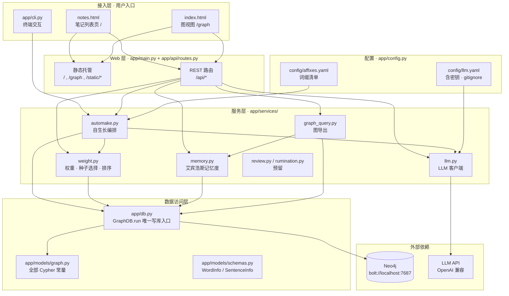
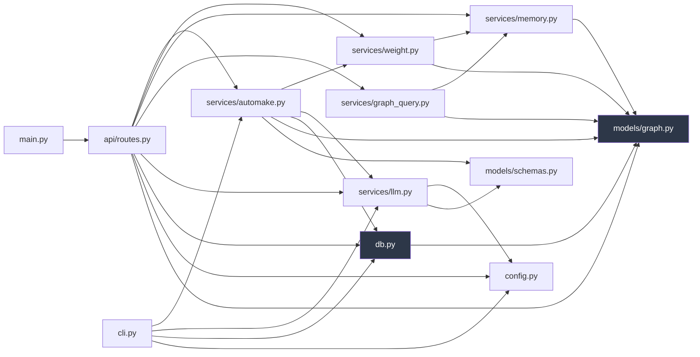
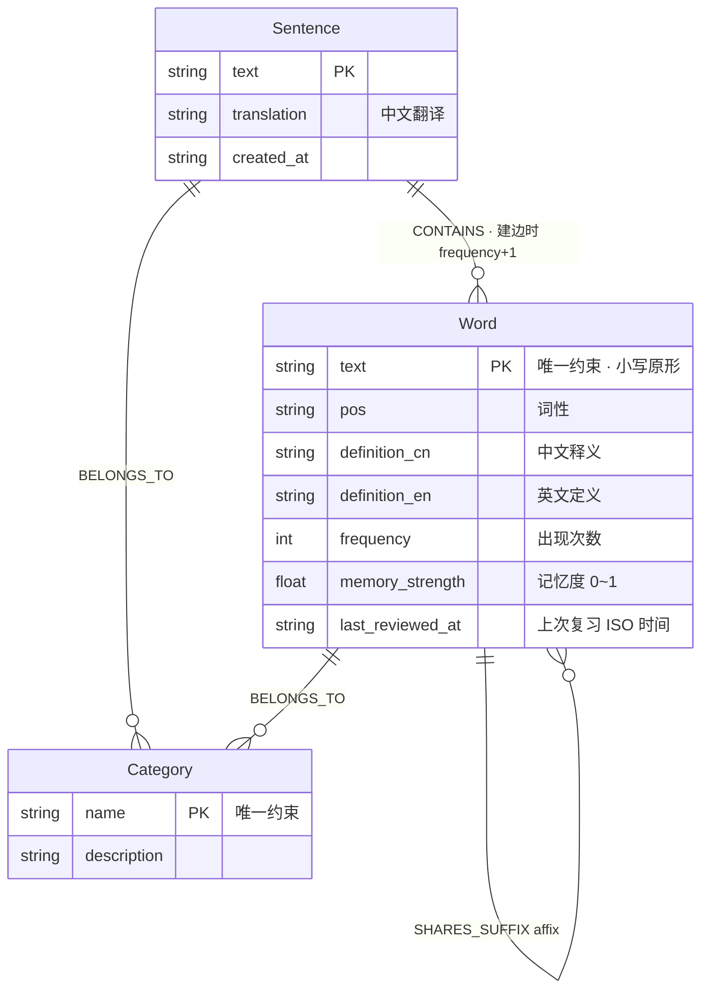
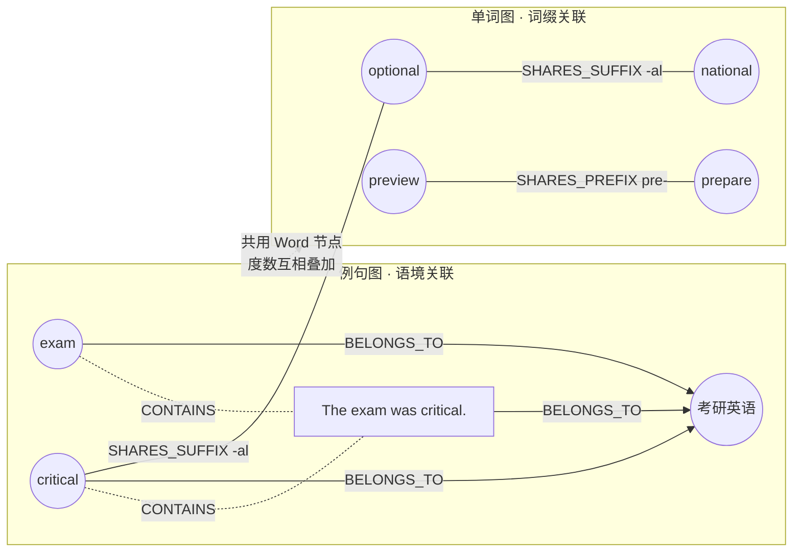
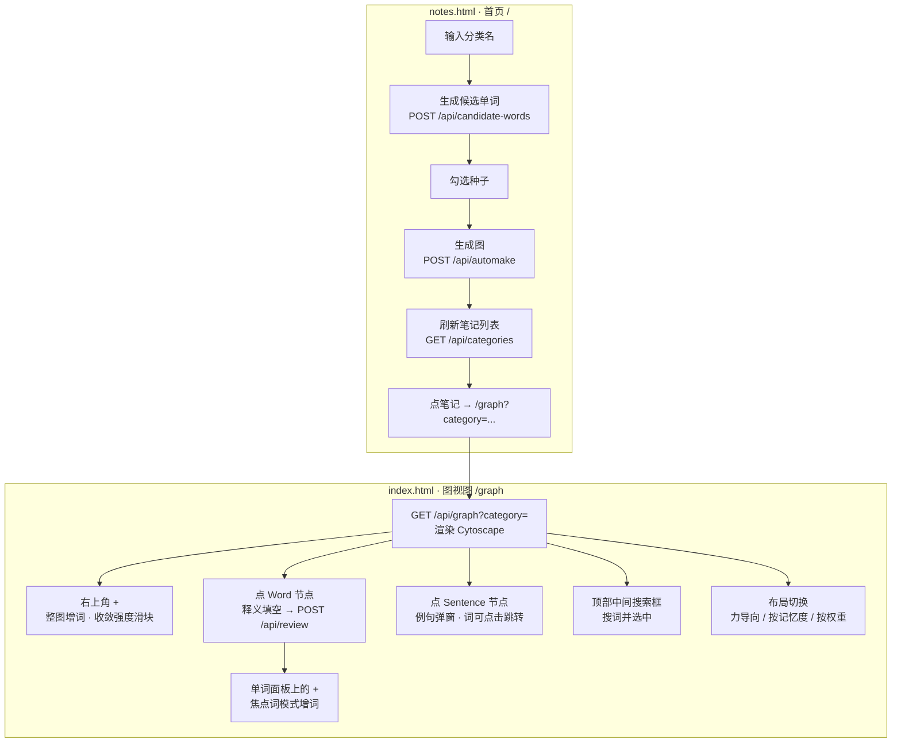
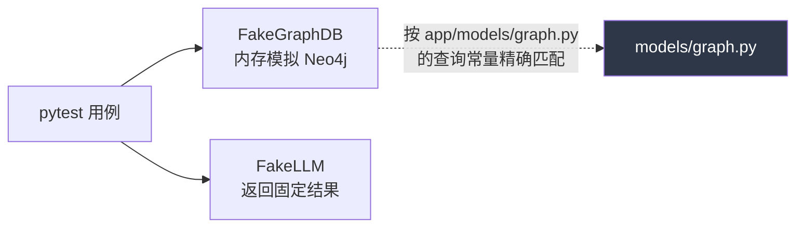

# 架构文档

> graph_memory —— 英文单词记忆图服务。
> 本文讲**系统由哪些部分组成、各部分职责、依赖关系、数据怎么存**。
> 数据怎么流动看 [DATAFLOW.md](DATAFLOW.md)，具体步骤看 [FLOWCHART.md](FLOWCHART.md)。

---

## 1. 一句话架构

一个 **FastAPI 单体服务** + **Neo4j 图数据库** + **外部 LLM（OpenAI 兼容接口）**，
前端是两个不依赖构建工具的单文件 HTML，用 Cytoscape.js 画图。

没有消息队列、没有缓存层、没有微服务。所有"智能"来自 LLM，所有"结构"来自 Neo4j。

---

## 2. 分层架构



**依赖方向恒为自上而下**：接入层 → Web 层 → 服务层 → 数据访问层 → 外部依赖。
服务层之间只有 `automake → weight/llm`、`graph_query → memory` 两条横向依赖，无环。

---

## 3. 模块依赖图（文件粒度）



两个"汇聚点"值得注意（图中深色）：

- **`models/graph.py`** —— 所有 Cypher 语句的唯一出处，任何模块要查图都从这里取常量。
- **`db.py`** —— 所有读写 Neo4j 的唯一通道（`GraphDB.run()`）。

这两处是有意收窄的：改查询只改一个文件，换存储只改一个文件。

---

## 4. 模块职责

### 4.1 入口层

| 文件 | 职责 | 说明 |
|---|---|---|
| `app/main.py` | FastAPI 应用装配 | 挂 `/api` 路由、`/static` 静态目录；`/` 返回 `notes.html`，`/graph` 返回 `index.html`（用 `FileResponse`，每次请求重读磁盘，所以改 HTML 不用重启，改 Python 要重启） |
| `app/api/routes.py` | REST 接口 + 请求模型 | 8 个端点；每个端点自己开关 `GraphDB` 连接（`try/finally`），无连接池 |
| `app/cli.py` | 终端交互入口 | `python -m app.cli`，走完整 autoMake 一轮，用于不开浏览器快速验证 |

### 4.2 服务层

| 模块 | 职责 | 关键设计 |
|---|---|---|
| `automake.py` | **自生长引擎**。编排"种子 → 例句 → 新词入图 → 词缀边" | 词形还原交给 LLM（`asserting → assert`），避免屈折形式拆成多个节点；`pick_seeds()` 三分支选种子 |
| `weight.py` | 单词重要度 + 种子采样 + 复习排序 | 基于六度空间理论：关联节点越多越核心。v1 用**度中心性**，**实时算不落库**，后续可升级 GDS PageRank |
| `memory.py` | 艾宾浩斯遗忘曲线 | `memory_strength = e^(-Δt / half_life)`，`half_life` 默认 7 天；入图时 `0.0`，复习后置 `1.0` |
| `graph_query.py` | 图结构导出给前端 | 输出 `{nodes, edges}`；Word 带实时记忆度 + 权重，Sentence 记忆度 = 所含词均值 |
| `llm.py` | LLM 客户端 | `generate_top_words` / `generate_definitions` / `generate_sentences`，返回 Pydantic 结构化对象 |
| `review.py` | 关联审查 | **预留**，审查例句质量 / 新词是否该入图 |
| `rumination.py` | 反刍 | **预留**，对生成结果二次修改，与艾宾浩斯复习无关 |

### 4.3 三个核心公式

| 概念 | 公式 | 所在 |
|---|---|---|
| 记忆度 | `memory_strength = e^(-Δt / half_life)`，从未复习 = `0.0` | `memory.py` |
| 权重归一化 | `weight_norm = degree / max_degree` | `weight.py` |
| 推送排序 | `score = weight_norm × (1 - memory_strength)` | `weight.rank_words` |
| 种子采样 | `distance = abs(weight_norm - intensity)`，升序取前 k | `weight.select_seeds` |

**收敛强度 `intensity ∈ [0,1]`**：不是阈值而是**采样锚点**——在权重光谱上取离 `intensity` 最近的词。

- `intensity = 1.0` → **收敛**：取核心高权重词，例句围绕已知词转，图变密
- `intensity = 0.0` → **扩张**：取边缘低权重词（多是上一轮刚入图的新词），例句带出更多生词，图变大

新词天然度数最低，所以低强度会自动把上一轮的 `new_words` 捞回来当种子——**自生长闭环不需要人工回灌**。

---

## 5. Neo4j 数据模型



### 两张互相促进的图



两张图**共用 `Word` 节点**，所以一个词在任一张图里长出的边都会抬高它的度中心性——这正是权重的含义："一个单词关联的节点越多越核心，记忆收益越高"。

### 约束与索引

`db.py:init_constraints()` 幂等创建：`Word.text` 唯一、`Category.name` 唯一。
每次 `POST /api/automake` 都会先调一次，所以不需要单独的迁移步骤。

### 已知局限

| 项 | 现状 | 影响 |
|---|---|---|
| 词缀匹配 | v1 是朴素 `startswith` / `endswith` 字符串匹配 | 会产生噪音边，如 `un-` 会匹配上 `under` |
| 词缀范围 | 只收派生词缀，不收屈折词缀（`-ing` / `-ed`） | 有意为之，避免屈折形式互连 |
| 权重算法 | 度中心性 | 无法区分"连了很多边缘词"和"连了少数核心词"，后续升级 PageRank |
| 连接管理 | 每请求新建 `GraphDB` | 无连接池，高并发下会成为瓶颈 |

---

## 6. 前端架构

两个**单文件 HTML**（内联 CSS + 内联 JS），无构建步骤，共用同一套暗色设计变量。
Cytoscape.js 从 `/static/cytoscape.min.js` 本地加载（已下载进仓库，不依赖 CDN）。



### 视觉编码约定

| 元素 | 编码 |
|---|---|
| Word 节点 | 单一蓝色，**亮度 = 记忆度**（暗 = 快忘光了，亮 = 刚复习过） |
| Category 节点 | 橙色 |
| Sentence 节点 | 灰色 |
| 邻接高亮 | 点击节点后邻接节点高亮、其余变暗 |
| 同心圆布局 | 值越大越靠圆心；Category 恒定 `100` 钉在最中心 |

### 一个前端约定（改代码时容易踩）

`index.html` **没有通用的 `.hidden` 规则**，只有针对具体 id 的
`#res-label.hidden, #res-none.hidden { display: none; }`。
这是故意的——加通用规则会破坏答题面板 / 例句弹窗的 opacity 淡入淡出。
新增需要隐藏的元素时，要么补一条 id 专属规则，要么用现有的显隐机制。

---

## 7. 目录结构

```
graph_memory/
├── app/
│   ├── main.py              # FastAPI 装配 + 页面托管
│   ├── cli.py               # 终端入口
│   ├── config.py            # yaml 配置加载
│   ├── db.py                # GraphDB · 唯一写库入口
│   ├── api/
│   │   └── routes.py        # 全部 REST 端点
│   ├── models/
│   │   ├── graph.py         # 全部 Cypher 常量
│   │   └── schemas.py       # WordInfo / SentenceInfo
│   ├── services/
│   │   ├── automake.py      # 自生长引擎
│   │   ├── weight.py        # 权重 / 种子采样 / 排序
│   │   ├── memory.py        # 艾宾浩斯
│   │   ├── graph_query.py   # 图导出
│   │   ├── llm.py           # LLM 客户端
│   │   ├── review.py        # 预留
│   │   └── rumination.py    # 预留
│   └── static/
│       ├── notes.html       # 首页
│       ├── index.html       # 图视图
│       └── cytoscape.min.js
├── config/
│   ├── llm.example.yaml     # 模板（已跟踪）
│   ├── llm.yaml             # 含密钥（gitignore）
│   └── affixes.yaml         # 词缀清单
├── tests/                   # pytest，不依赖真实 Neo4j / LLM
├── docs/                    # 本文档目录
├── docker-compose.yml       # Neo4j
└── CLAUDE.md
```

---

## 8. 测试架构

测试**完全不依赖真实 Neo4j 和 LLM API**，靠两个替身：



`FakeGraphDB` 用**查询字符串精确匹配**来分发——所以往 `models/graph.py` 加新 Cypher 常量时，
如果测试要覆盖它，必须同步在 Fake 里加一个分支，否则会静默返回空列表。

```bash
python -m pytest                        # 全部
python -m pytest -v                     # 详细
python -m pytest tests/test_automake.py # 单文件
python -m pytest -k <name>              # 单用例
```

---

## 9. 环境约束（本机特有，容易踩）

| 项 | 约束 |
|---|---|
| Python | 系统默认 `python` 是 3.7（anaconda base），**必须用 `python3.10`** |
| pip 源 | 默认源被墙，需 `-i https://pypi.tuna.tsinghua.edu.cn/simple` |
| venv | `python3.10 -m venv` 可能缺 `ensurepip`，需先 `apt install python3.10-venv`；装不上就直接用系统 `python3.10 -m pip install` |
| 热更新 | HTML 改了立即生效（`FileResponse` 每请求重读磁盘）；**Python 改了必须重启 uvicorn**，除非带 `--reload` |
| 密钥 | `config/llm.yaml` 含 API key，已在 `.gitignore`，**不要提交** |
