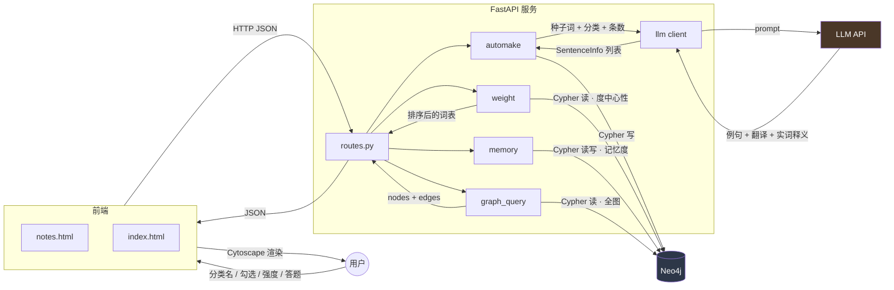
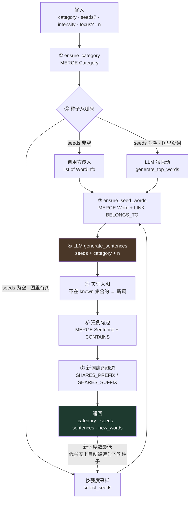
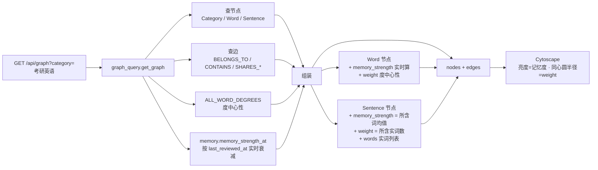
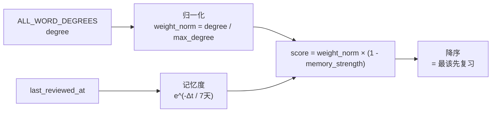
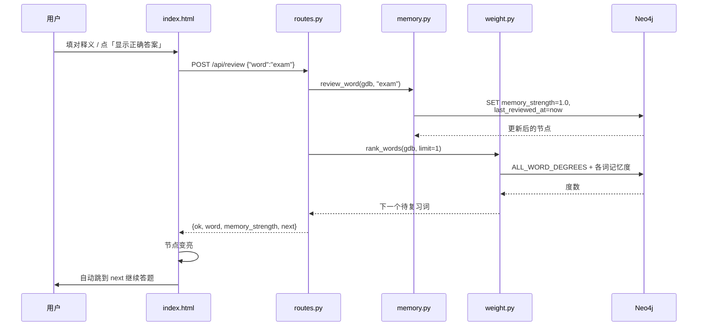
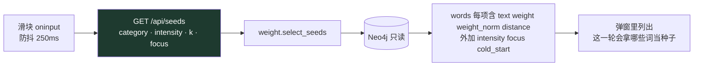
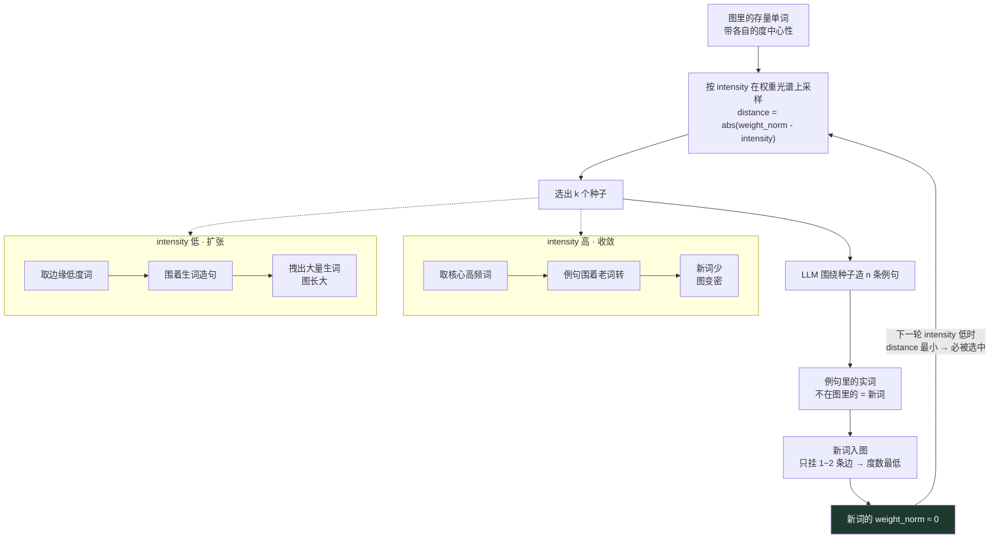
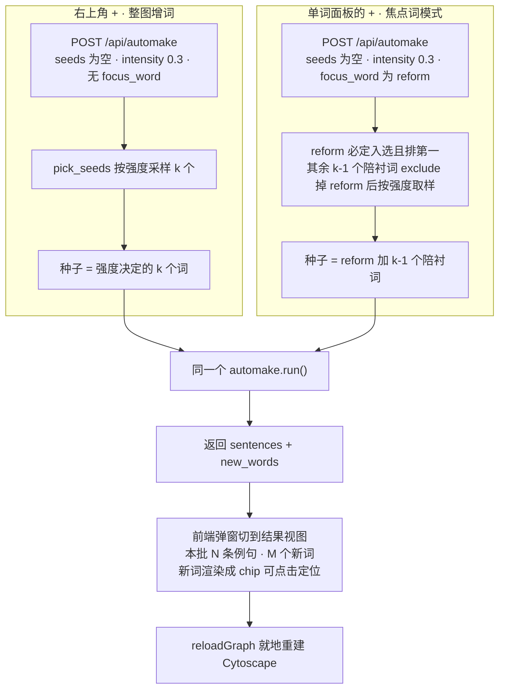

# 数据流图

> 讲**数据从哪来、经过谁、变成什么形态、落到哪去**。
> 系统组成看 [ARCHITECTURE.md](ARCHITECTURE.md)，分支判断和交互步骤看 [FLOWCHART.md](FLOWCHART.md)。

---

## 1. 全局数据流总览

**三种外部数据源**：用户输入（分类、勾选、强度、答题）、LLM 产出（例句和释义）、Neo4j 存量（已有的词和边）。
**唯一的真相来源是 Neo4j**——记忆度、权重都是从图里**实时算出来的**，不缓存、不落中间态。

---

## 2. 写路径：autoMake 一轮的数据流

这是系统里唯一会写库的路径。数据形态在每一步都发生变化：

### 数据形态变化表

| 阶段 | 数据形态 | 示例 |
|---|---|---|
| 前端提交 | JSON | `{"category":"考研英语","seeds":[],"intensity":0.2,"n_sentences":10}` |
| 路由解析 | `AutoMakeRequest`（Pydantic） | 带默认值：`n_seeds=5`、`focus_word=""` |
| 种子选择后 | `list[str]` 或 `list[WordInfo]` | `["anxiety","reform","exam"]` |
| LLM 请求 | prompt 文本 | "用这些词造 10 个考研英语例句…" |
| LLM 响应 | `list[SentenceInfo]` | 每条含 `sentence`、`translation`、`words[]` |
| 单词条目 | `WordInfo` | `{word:"assert", pos:"v.", definition_cn:"断言", definition_en:"..."}` |
| 落库 | Cypher 参数 | `MERGE (w:Word {text:$text}) SET ...` |
| 响应 | JSON | `{"ok":true,"auto_seeds":true,"new_words":["assert","reform"],...}` |

### 关键点：词形还原在 LLM 侧

LLM 返回的 `words[]` **已经是原形**（`asserting → assert`），不再用本地正则从句子里抠词。
这样每个入图的词都自带词性和中英释义，且不会因为屈折形式（`assert` / `asserts` / `asserting`）
拆成三个节点把图撑散。

### 关键点：`known` 快照决定"新词"

`run()` 在生成例句**之后**、写库**之前**取一次 `existing_words()` 快照。
判定 `is_new` 时对照这个快照并**边写边更新**（`known.add(word)`），
所以同一批例句里重复出现的词只会被算作一次新词，且只建一次词缀边。

---

## 3. 读路径

### 3.1 `GET /api/graph` —— 前端渲染的数据来源

**为什么 `weight` 要从后端给**：前端同心圆布局用的 `weight` 和推送排序用的权重
必须是**同一个 `ALL_WORD_DEGREES` 查询**的结果，否则"图上看起来最核心的词"
和"系统推荐先复习的词"会对不上，用户会觉得系统在自相矛盾。
（前端仍保留 `node.degree()` 作为 `weight` 缺失时的兜底。）

### 3.2 `GET /api/rank` —— 推送复习顺序

含义直白：**又重要、又快忘光了** 的词排最前。
从没复习过的词 `memory_strength = 0`，所以 `score = weight_norm`——高频核心词天然排在最前面。

### 3.3 `POST /api/review` —— 复习回写

这是除 autoMake 外**唯一会写库**的路径，但只改 Word 节点的两个属性：

一次请求同时完成"记这次复习"和"给下一题"，前端不用再发一次 `/api/rank`。

### 3.4 `GET /api/seeds` —— 滑块的即时预览

**这条路只读图，不调 LLM、不写库**——所以可以随手拖滑块，成本只有一次 Cypher 查询。
带 `focus` 时返回的是**陪衬词**（焦点词自身已从采样中排除，由前端单独展示），此时 `cold_start` 恒为 `false`。

---

## 4. 自生长闭环

这是整个项目的核心机制。**闭环不需要任何人工回灌**：

### 为什么闭环能自动成立

新入图的词只挂着"1 条 `BELONGS_TO` + 1 条 `CONTAINS`"，度数是全图最低的。
`select_seeds` 用 `abs(weight_norm - intensity)` 排序，当 `intensity` 接近 0 时，
这些 `weight_norm ≈ 0` 的新词 `distance` 最小，**自动排到最前面**。

所以调用方**不需要**把上一轮的 `new_words` 传回去——图结构本身就记住了"谁是新词"。

### 滑块该放哪：一个曾经踩过的坑

强度**只在图已经长出来之后才有意义**。冷启动时 `select_seeds` 返回 `[]` 直接回退 LLM，
滑块拖到哪都没区别。所以滑块在**图页面**，不在首页。

首页只管"从零建一张图"（冷启动，半自动勾选），图页面才管"让图继续长"（增词，滑块控制方向）。

---

## 5. 两个"+"的数据流对比

图页面上有两个增词入口，走同一个 `POST /api/automake`，区别只在 `focus_word`：

焦点词模式下滑块的含义变了：不再控制"选哪些种子"，而是控制**陪衬词是核心词还是生词**——
强度高则围绕焦点词 + 核心高频词造句，强度低则围绕焦点词 + 边缘生词造句。

焦点词本身就是合法种子，所以**这条路永远不走 LLM 冷启动**。

### `exclude` 的一个细节

被 `exclude` 的词**不参与采样，但仍参与归一化基准**（仍算进 `max_degree`）。
否则去掉一个高权重词后，剩余词的 `weight_norm` 会整体被抬高，
"核心度"这把尺子会漂移——同一个 `intensity` 在两次调用里选出不同性质的词。

---

## 6. 数据一致性约定

| 约定 | 原因 |
|---|---|
| 记忆度、权重**不落库**，每次读时实时算 | 记忆度随时间连续衰减，落库就必须定时刷新；度中心性随边变化，落库就必须在每次写边后同步 |
| 只有 `last_reviewed_at` 落库 | 它是衰减曲线的锚点，是唯一需要持久化的状态 |
| 所有 Cypher 集中在 `models/graph.py` | 前端布局和后端排序必须用同一个 `ALL_WORD_DEGREES`，共用常量才能保证口径一致 |
| 所有写库经 `GraphDB.run()` | 单一入口，便于日后加事务、重试、审计 |
| 单词一律 `strip().lower()` 后入图 | `Word.text` 是唯一约束，大小写不统一会造出重复节点 |
