# 流程图

> 讲**每一步怎么走、遇到分支怎么判、出错回退到哪**。
> 系统组成看 [ARCHITECTURE.md](ARCHITECTURE.md)，数据形态变化看 [DATAFLOW.md](DATAFLOW.md)。

---

## 1. 登录/注册流程

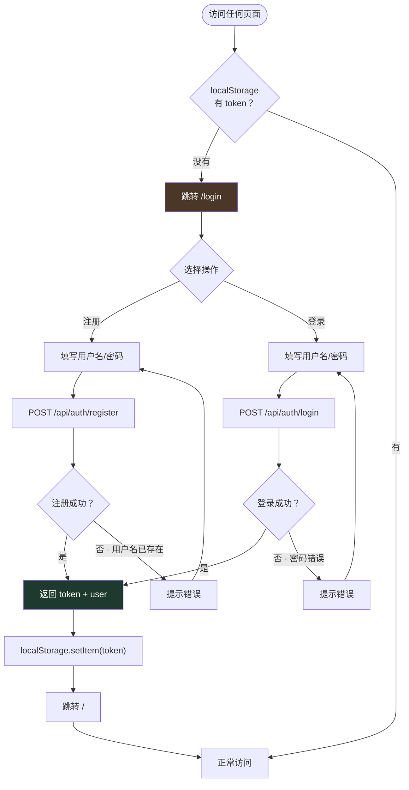

**关键点**：
- 所有页面都有登录检查，未登录跳转 `/login`
- 登录成功返回 JWT token，有效期 24 小时
- token 存储在 `localStorage`，后续请求自动带上

---

## 2. autoMake 一轮完整流程

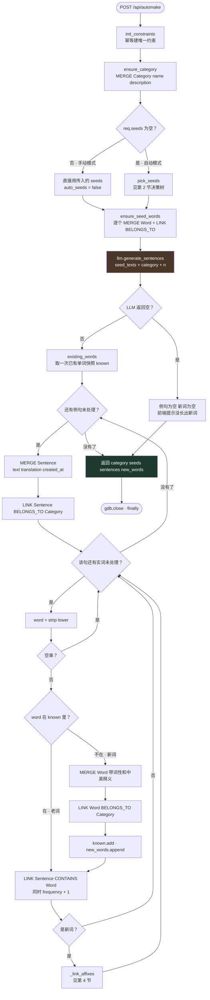

**注意执行顺序**：`existing_words()` 快照取在**生成例句之后、写例句之前**。
如果取得太早（比如在 `ensure_seed_words` 之前），种子词自己会被误判成新词。

---

## 3. 种子选择决策树

`pick_seeds()` 只有三条出路，判断顺序不能换：

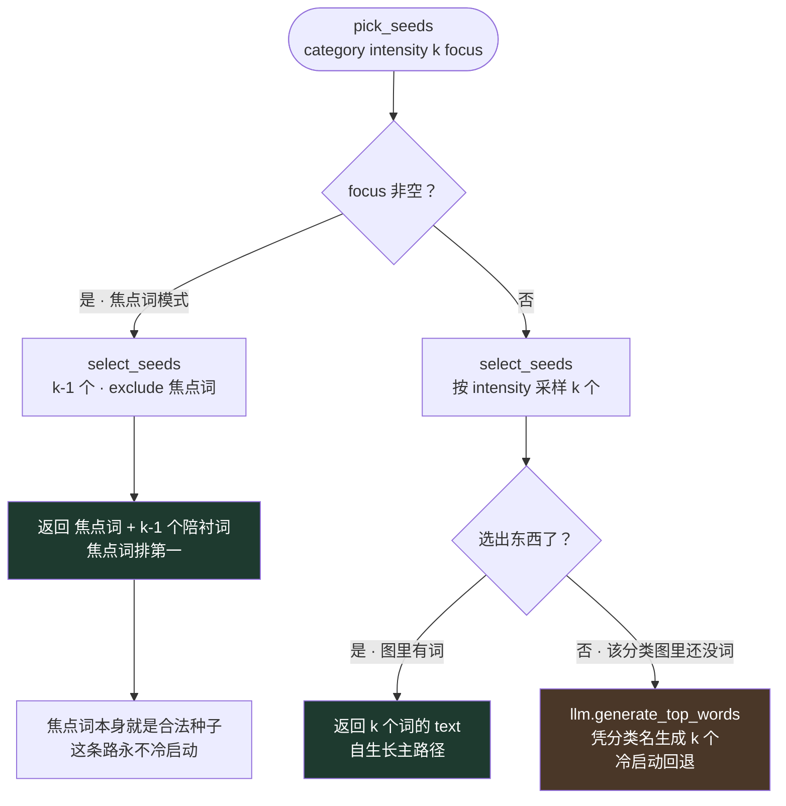

| 分支 | 触发条件 | 是否调 LLM | 对应前端入口 |
|---|---|---|---|
| 手动 | `req.seeds` 非空 | 否（种子已定） | 首页勾选后「生成图」 |
| 焦点词 | `seeds` 空 + `focus_word` 非空 | 否 | 图页面单词面板上的「+」 |
| 强度采样 | `seeds` 空 + 图里有词 | 否 | 图页面右上角「+」 |
| 冷启动 | `seeds` 空 + 图里没词 | **是** | 图页面「+」但分类是空的 |

### 一个曾经的 bug：`k=0`

焦点词模式下 `k-1` 可能等于 `0`。原实现写的是 `return scored[:k] if k else scored`，
Python 里 `0` 是假值，会被当成"没传 k"，于是**把整个分类的词全部返回**当种子。
现在改成显式区分 `None` 和 `0`：

```python
if k is None:
    return scored
return scored[:max(0, k)]
```

（对应用例 `test_zero_k_selects_nothing`。）

---

## 4. 收敛强度采样

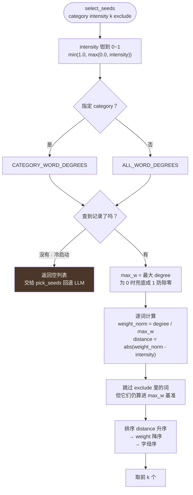

### 采样直觉

把分类里所有词按归一化权重摊在 0~1 的数轴上，**滑块停在哪，就从哪附近抓词**：

```
weight_norm:  0.0 ────────────────────────────── 1.0
              anxiety  reform   critical   exam
              (2度)    (5度)    (7度)     (16度)
                ↑                            ↑
       intensity=0.0                 intensity=1.0
       扩张：抓边缘生词              收敛：抓核心高频词
       例句带出大量新词              例句围着老词转
       图变大                        图变密
```

排序的三级兜底（`distance` → `-weight` → 字母序）是为了**结果稳定可测**：
同样的图 + 同样的强度，永远选出同样的种子，测试才能断言。

---

## 5. 词缀边构建

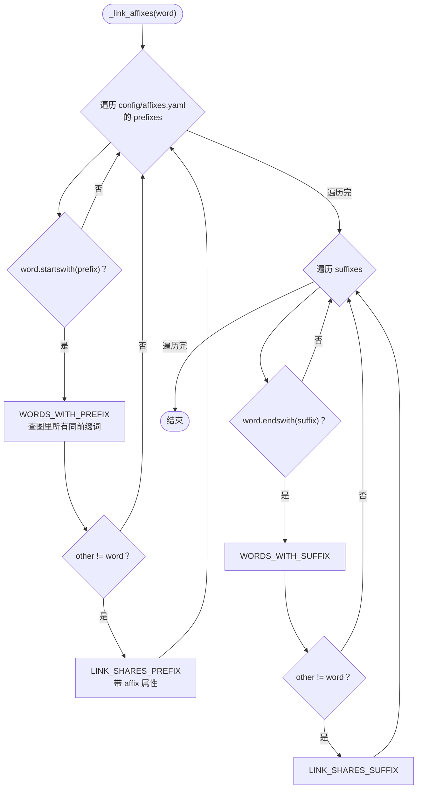

**只对新词建边**（老词的词缀边在它当初入图时已经建过了）。

**v1 的已知噪音**：朴素 `startswith` / `endswith` 字符串匹配，
前缀 `un-` 会把 `under`、`uncle` 也匹配进来。词缀清单只收派生词缀、
不收屈折词缀（`-ing` / `-ed`），避免同一个词的不同形态互连。

---

## 6. 记忆度与复习循环

### 6.1 一个单词的记忆度生命周期

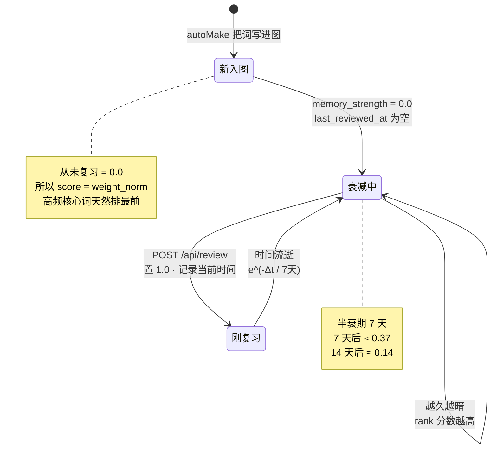

### 6.2 前端复习循环

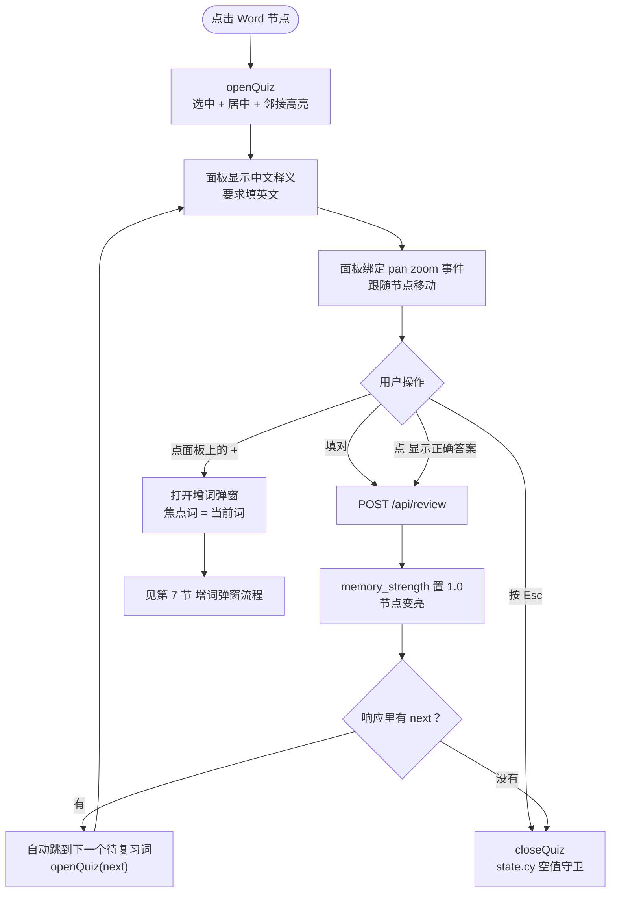

**闭环**：答对 → 变亮 → 自动跳下一题，不用手动找词。
下一题是 `rank` 第一位，即"最重要且最快忘光"的那个。

---

## 7. 前端首页流程（冷启动建图）

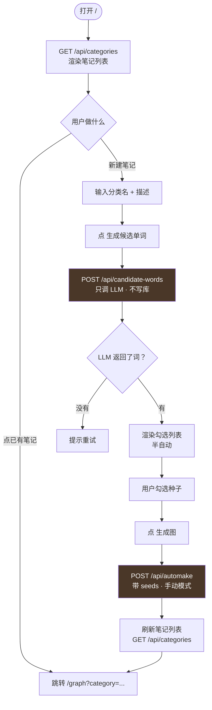

**首页没有滑块**——冷启动时图里没词，`select_seeds` 直接返回空、回退 LLM，
滑块拖到哪都不起作用。放上去只会误导。

---

## 8. 图页面增词弹窗流程

两个「+」共用同一个弹窗，区别只在带不带 `focus_word`：

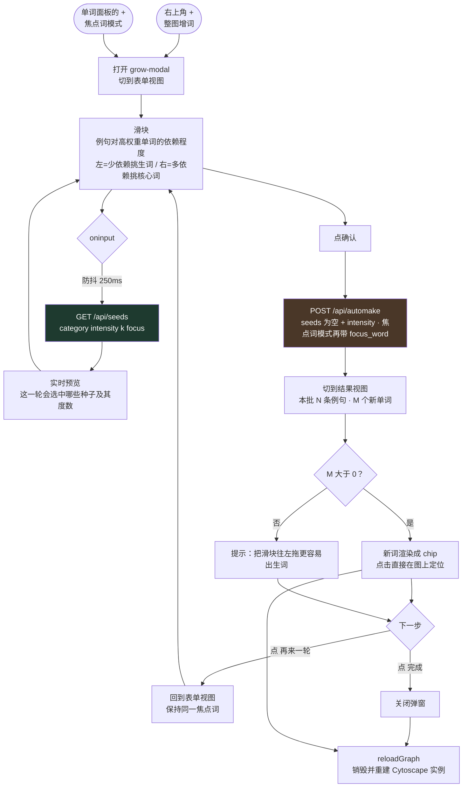

### 两个约束

1. **整图视图（URL 无 `?category=`）下两个「+」都隐藏**——写库必须落到某个 Category，
   分类不明确就没法写。
2. **`reloadGraph()` 期间 `state.cy` 会短暂为 `null`**，所以 `closeQuiz`、
   `closeSentencePanel`、面板跟随回调都做了空值守卫，否则重建过程中触发这些回调会报错。

---

## 9. 搜索框流程

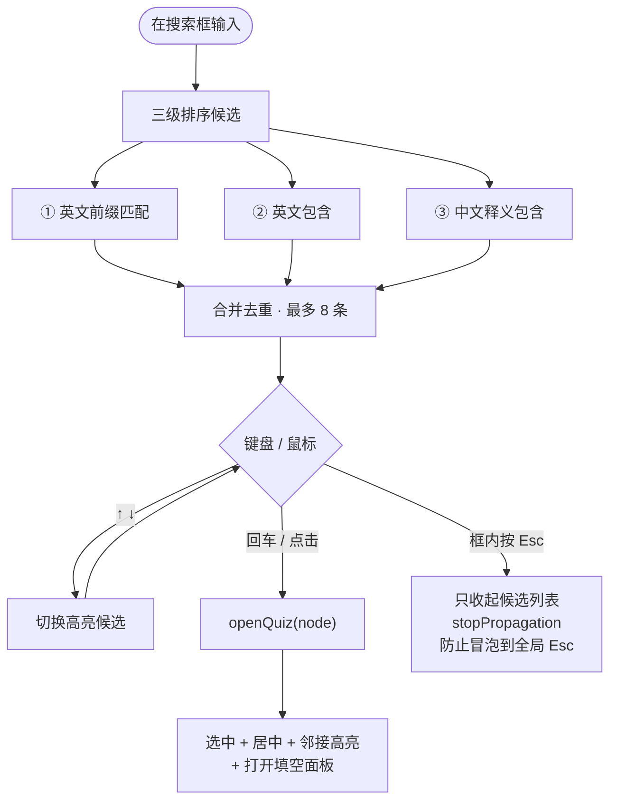

框内 Esc 必须 `stopPropagation()`：不然会冒泡到全局 Esc 处理器，
把刚打开的填空面板一起关掉。

---

## 10. 布局切换流程

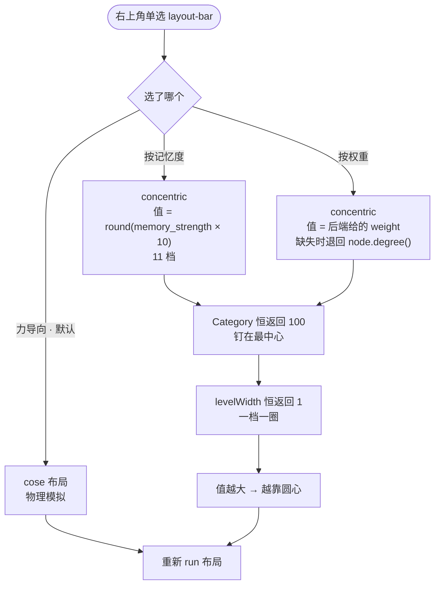

### 两个必须记住的点

- **`concentric` 回调返回值越大，排得越靠圆心**（不是越靠外）。
  所以"记得越牢越靠中心"要用 `memory_strength × 10`，不能取反。
- **`levelWidth: () => 1` 不能省**。默认的 `levelWidth` 会把相近的值归成一档，
  结果所有节点挤成一两圈，完全看不出层次。

已用 headless Cytoscape 实测验证过：权重模式下 `exam`(12) 距圆心 23px、
`critical`(7) 46px、`anxiety`(2) 69px；记忆度模式下顺序相反。

---

## 11. 测试流程

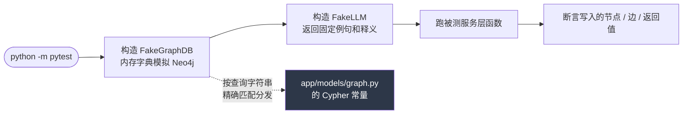

**加新 Cypher 常量时的注意事项**：`FakeGraphDB` 是靠**查询字符串精确匹配**来分发的。
往 `models/graph.py` 加了新常量、而 Fake 里没加对应分支时，
`run()` 会**静默返回空列表**而不是报错——测试可能假绿。
所以新增查询后，要么在 Fake 里补分支，要么确认没有测试路径会走到它。
